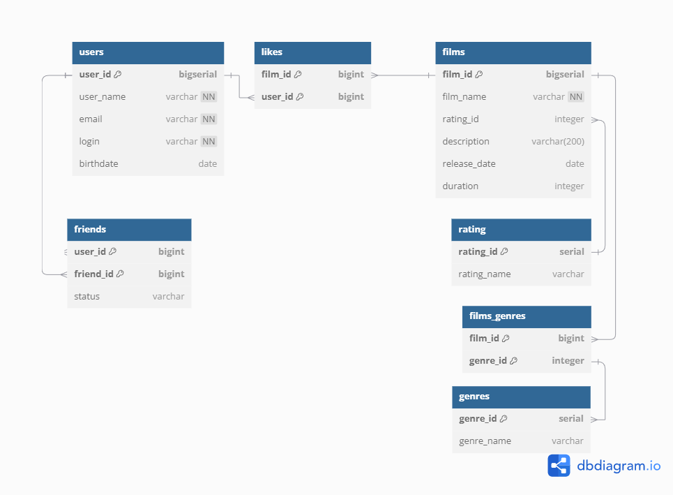

# java-filmorate

# *Схема базы данных*


---

#### `users` - *Содержит информацию о пользователях.*

*Таблица состоит из полей:*

*Первичный ключ* `user_id` — *идентификатор пользователя;*
* `user_name` — *имя пользователя;*
* `email` — *email пользователя [уникальное не нулевое поле];*
* `login` — *login пользователя [уникальное не нулевое поле];*
* `birthday` — *дата рождения;*
  
---

#### `friends` - *Содержит информацию о друзьях.*

*Таблица состоит из полей:*

* `user_id` — *пользователь, который отправил запрос на добавление в друзья;*
* `friend_id` — *пользователь которому отправлен запрос в друзья;*
* `status` — *статус запроса, например* (`PENDING`, `APPROVED`)
  *В этой таблице составной первичный ключ по полям* `initiator_id` *и* `friend_id`

---

#### `likes` - *Содержит информацию о лайках к фильмам из таблицы* `film`.

*Таблица состоит из полей:*

* `film_id` — *идентификатор фильма из* `film`;
* `user_id` — *идентификатор пользователя из* `user`;
  *В этой таблице составной первичный ключ по полям* `film_id` *и* `user_id`

---

#### `films` - *Содержит информацию о фильмах.*
*Таблица состоит из полей:*
*первичный ключ `film_id` — идентификатор фильма;*
* `film_name` — *название фильма;*
* `rating_id` — *идентификатор рейтинга из rating;*
* `description` — *описание фильма;*
* `release_date` — *дата выхода;*
* `duration` — *продолжительность фильма в минутах;*

---

#### `rating` - *Содержит информацию о рейтингах Motion Picture Association.*

*Таблица состоит из полей:*

* `rating_id` — *первичный ключ идентификатор рейтинга;*
* `rating_name` — *название рейтинга;*

---

#### `film_genres` - *Содержит информацию о жанрах фильмов из таблицы* `film`.

*Таблица состоит из полей:*

* `film_id` — *идентификатор фильма из* `film`;
* `genre_id` — *идентификатор жанра из genre;*
  *В этой таблице составной первичный ключ по полям* `film_id` *и* `genre_id`

---

#### `genres` - *Содержит информацию о жанрах фильмов.*

*Таблица состоит из полей:*

*Первичный ключ `genre_id` — идентификатор жанра;*
* `genre_name` — *название жанра;*


## Примеры запросов к базе данных


Запрос списка пользователей лайкнувших фильм с id = 1:

```sql
SELECT u.user_id,
       u.name,
       u.email
FROM films AS f
LEFT JOIN likes  AS l on f.film_id = l.film_id
LEFT JOIN "users" AS u on u.user_id = l.user_id
WHERE f.film_id = 1;
```

Запрос списка друзей пользователя с id = 1:

```sql
SELECT u.user_id,
       u.name,
       u.login,
       u.email
       
FROM (SELECT user_id AS user_id
      FROM friends
      WHERE user_id = 1 OR friend_id = 1 AND status = 'APPROVED'

      UNION

      SELECT friend_id AS user_id
      FROM friends
      WHERE user_id = 1 OR friend_id = 1 AND status = 'APPROVED') AS users_list
LEFT JOIN "user" AS u ON u.user_id = users_list.user_id
WHERE users_list.user_id != 1;
```